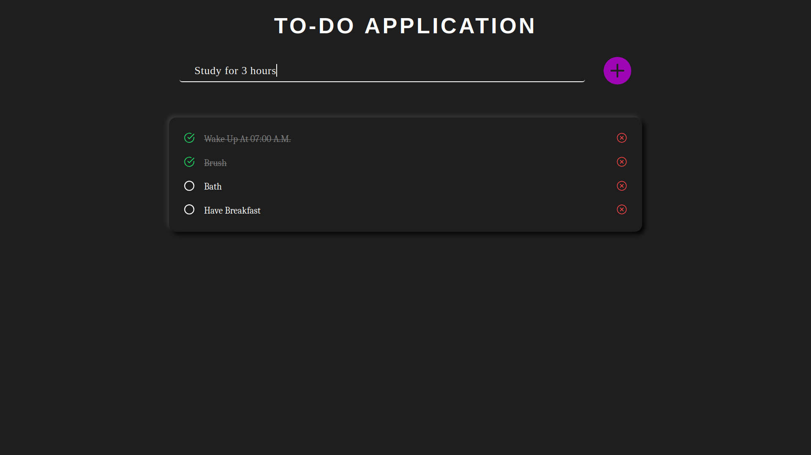
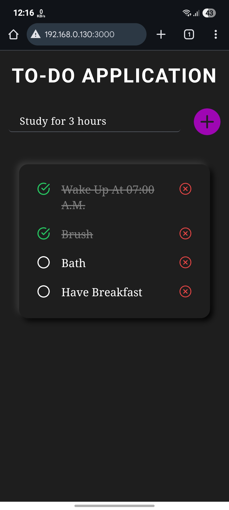

# To-Do Application 📝

A sleek and modern To-Do application built with React and Tailwind CSS. This project provides a clean and intuitive interface for managing daily tasks, with data persistence powered by local storage.

## 📸 Screenshots



*A preview of the To-Do Application's main interface (Desktop View)*


*The application in dark mode, showcasing task management (Mobile View)*

## ✨ Features

-   **➕ Add & Manage Tasks**: Quickly add new tasks to your list.
-   **✔️ Mark as Complete**: Toggle the status of tasks between pending and completed.
-   **❌ Delete Tasks**: Easily remove tasks you no longer need.
-   **💾 Local Storage Persistence**: Your tasks are saved in your browser's local storage, so they'll be there when you return.
-   **📱 Responsive Design**: A clean and user-friendly interface that works on all screen sizes.
-   **🎨 Modern UI**: Styled with Tailwind CSS for a professional and modern look.
-   **⌨️ Keyboard Support**: Add tasks by simply pressing the "Enter" key.

## 🚀 Getting Started

### Prerequisites

-   Node.js (v16.0.0 or higher recommended)
-   npm or yarn package manager

### Installation

1.  **Clone the repository**
    ```bash
    git clone https://github.com/schandra2609/todo-application.git
    cd todo-application
    ```

2.  **Install dependencies**
    ```bash
    npm install
    # or
    yarn install
    ```

3.  **Start the development server**
    ```bash
    npm run dev
    # or
    yarn dev
    ```

4.  **Open your browser**
    Navigate to the local server address provided in your terminal (usually `http://localhost:3000` or a similar port) to use the application!

### Build for Production

```bash
npm run build
# or
yarn build
```

This will create a `dist/` folder with optimized and production-ready static files for deployment.

## 🎯 How to Use

1.  **Add a Task**: Type your task into the input field and click the plus icon or press `Enter`.
2.  **Complete a Task**: Click the circle icon next to a task to mark it as complete. The task will be visually distinguished (e.g., with a line-through).
3.  **Delete a Task**: Click the 'x' icon to permanently remove a task from your list.
4.  **Persistent Storage**: Your tasks are automatically saved to your browser's local storage, so they will be available the next time you open the application.

## 🛠️ Tech Stack

-   **Frontend Framework**: React
-   **Styling**: Tailwind CSS
-   **Icons**: React Icons
-   **Build Tool**: Vite

## 🤝 Contributing

Contributions are welcome! If you have ideas for improvements or want to fix a bug, please feel free to:

1.  **Fork the repository**
2.  **Create a feature branch**
    ```bash
    git checkout -b feature/your-amazing-feature
    ```
3.  **Commit your changes**
    ```bash
    git commit -m 'Add some amazing feature'
    ```
4.  **Push to the branch**
    ```bash
    git push origin feature/your-amazing-feature
    ```
5.  **Open a Pull Request**

### Development Guidelines

-   Follow React best practices for component structure.
-   Utilize Tailwind CSS for all styling needs.
-   Keep code clean, commented, and easy to understand.
-   Ensure your changes are tested before submitting a pull request.

## 📝 License

This project is licensed under the MIT License - see the [LICENSE](LICENSE) file for details.

## 👨‍💻 Author

**Sayan Chandra**
- 📧 Email: sayanchandra89@gmail.com
- 📱 Phone: +91-9883126020
- 🔗 GitHub: [@schandra2609](https://github.com/schandra2609)

## 🙏 Acknowledgments

-   Built as a personal project to practice React and Tailwind CSS.
-   Inspired by the need for simple and effective task management tools.
-   Thanks to the developers of React, Tailwind CSS, and the open-source community.

---

**⭐ Star this repository if you found it useful!**

*Made with ❤️ by Sayan Chandra*